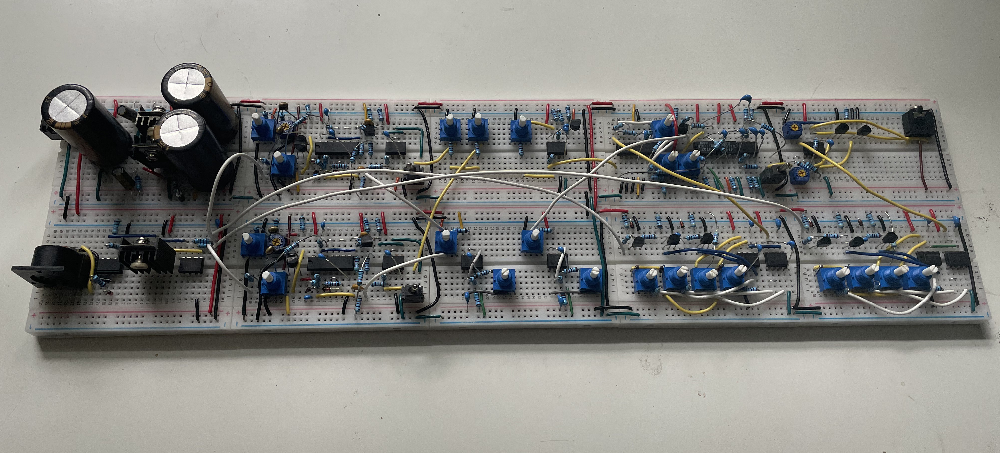
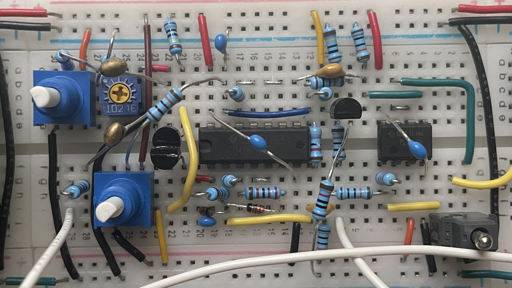
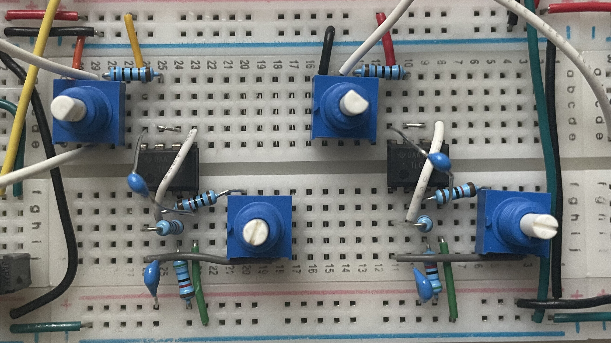
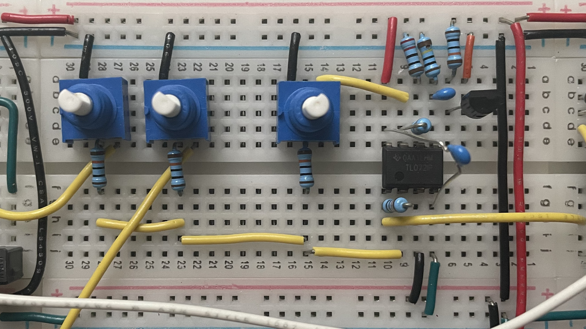
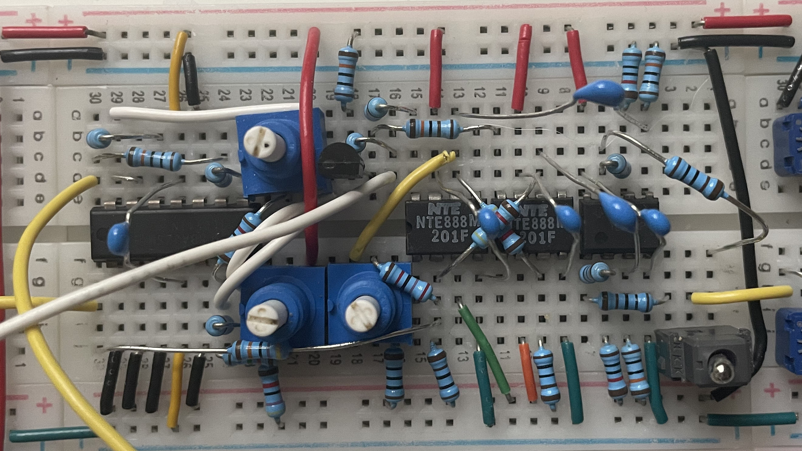
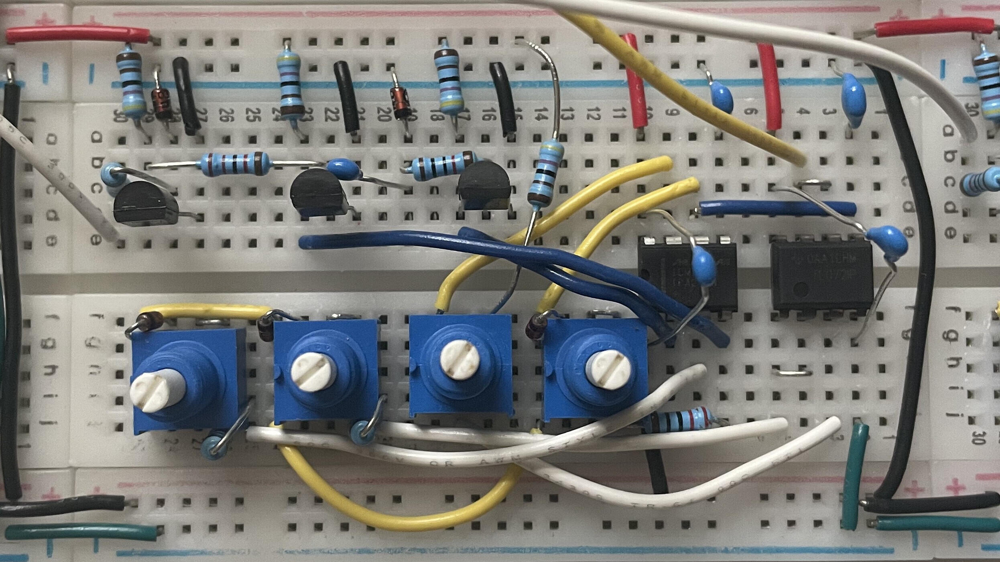
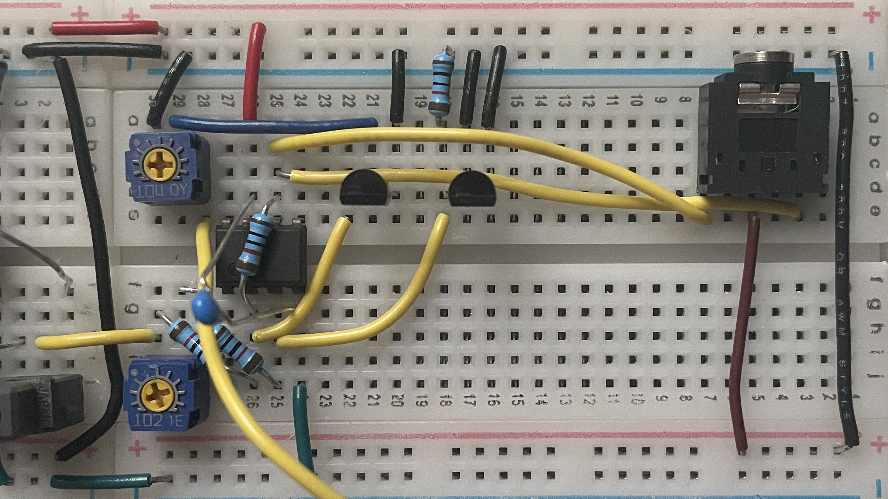

+++
title = "BS-1: Breadboard Synthesizer"
date = 2021-08-25
draft = true
+++

hewwo

<!-- more -->

### Rules of the Game

Before I started picking out designs for components, I set up two simple rules to help narrow things down:

* No chips that do everything for me (e.g. CEM3340)
* Each module must fit on a standard 400-terminal breadboard

I didn't want the project to be too easy, but I also did not want to spend 12 hours straight building a filter.

### VCOs

For the oscillators, I chose the [VCO 4069](https://www.schmitzbits.de/vco4069.html) design by René Schmitz:

A genuis design based around the 4069 CMOS Hex Inverter, it provides both a saw and a PWM output.

#### Rationale

I was really attracted to the use of an inverter chip to create an oscillator, as to someone like me who is a relative beginner with analog electronics, it seems so esoteric.
I also liked the simplicity of the circuit, since that way it would fit on the single breadboard I wanted it on.
Finally, PWM was a requirement to me, so I was happy to find out that simple circuits could provide it.

#### Construction Notes

Fitting this circuit on the single breadboard was a little tricky, especially the core saw wave part, which you can see at the bottom side of the 4069.
More annoyingly, though, I ran into an issue where the circuit would generate some sort of buzzing on the power rails.
After I had built the VCF, I found that even with the oscillator fully detached, a buzz would still come into the filter.
I ended up solving this by touching my pliers to random parts of the circuit, ultimately finding that when I touched pin 13 of the 4069, the buzz would go away.
Knowing that my pliers were introducing some sort of capacitance, I put a small ceramic capacitor between pin 13 and ground, and the buzz went away.
If anyone can actually explain what was happening, I would definitely appreciate it!

#### Caveats

I found that the PWM control was a bit strange, and 50% on the potentiometer does not actually correspond to 50% pulse width.
Given that I built this circuit twice, I don't think I made an error in construction, and I guess that's just how it is.

### LFOs

To get a little modulation going, I built two simple op-amp relaxation LFOs:

These are hardwired to the PWM input of each oscillator and the filter cutoff.
Not much to say about these since it is such a simple circuit.
I cannot even remember the exact website I got it off of as it is so ubiquitous.

### Mixer + Noise Source

Another simple circuit: just a 3 channel summing mixer with a transistor breakdown white noise source:

This mixes together both of the oscillators and adds a little texture with the white noise before going off to the VCF.

#### Construction Notes

The transistor noise was actually a little tricky to nail down.
Most example schematics for the most minimal design use a common emitter amplifier to bring up the noise.
However, I wanted to use an op-amp so that I could use a dual op-amp chip and combine it with the mixer.
While making an amplifier with an op-amp is easy, it took me a while to realize that I needed to amplify way more than I thought I would have to.
I forget what gain I ultimately set it to, but it is still too low, and at this point I am too lazy to fix it.
Not sure if that issue comes down to not using the right value resistor on the transistor, or if I really just need to set the gain higher.

### VCF

Here is the real star of the show, the Polivoks VCF clone:

This design comes from [Dave Brown](https://modularsynthesis.com/kuzmin/polivoks/polivoks_vcf.htm), which in turn is a modified version of Marc Bareille's design, using NTE888M op-amps as a replacement for the original Soviet ones.

#### Rationale

Picking out a VCF was *really* hard.
Most people seem to either recommend a full-on Moog filter or the absolute bare minimum op-amp thingy.
However, I wanted something between those two.
After looking all over the place, I came across this genius design.
Ordering the NTE888Ms was a bit annoying, but in the end it was worth it.

#### Construction Notes

I ended up cutting out a couple features from the design due to limited space on the breadboard.
First off, I removed the 1V/oct FM input, which I did not really mind that much since I did not intend to patch pitch CV into the filter anyway.
Secondly, I had to remove the switch between hard and soft clipping in the filter, which is a bit of a shame when doing self-oscillation.
It would be nice to have a less aggressive mode, but I guess that could come in a future synthesizer.

### ADSRs

### VCA

### The Rest

### Demo Video
